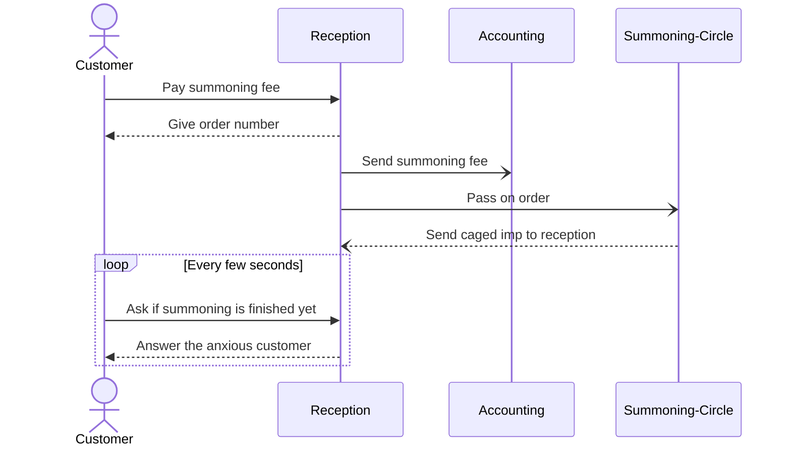

# Bartholomews Impery

Welcome to Bartholomews impery, your cheap and (mostly) reliable imp-summoning service.
This project aims to be a (simple) hands-on example of how to create a distributed system with asynchronous communication.
At this moment my goal is to explore various concepts used to work with a distributed and event-driven microservice system.

## The setup
Barht's establishment is comprised of various departments, each taking care of an important part of the lucrative and (mostly) reliable business of purveying fun-sized demons.
- The reception: this is where Barth personally takes orders (and the customers money).
- The treasurery: this is where the accountant manages the money of this humble business.
- The summoning-circle: is where (underpaid) employees summon the imps. Famously, nothing ever goes wrong when summoning hellish entities...

## The saga of summonings
First, i want to start off by exploring sagas. Here is how we do it:

### Simulating failure and unreliability
In order to learn something from this excercise, we want stuff to go wrong. In our case, we start simple. Here is what can go wrong:
1. Failed summonings: Oops. Either the overworked and underappreciated summoner slipped on a banana peel during the summoning, or they accidentally read the wrong scroll and tried to summon something... a bit more feisty than a mere imp. Either way, the summoning went south.
2. No more summoners available: Bartholomew should probably pay more than the mandatory minimum wage if he wants to attract more workers. After many a failed summoning, Barth is out of workers. At least for now.

### Workflows

#### Happy Path
The customer orders an imp, pays Barth the fee, and waits until the summoning is finished. Barth tosses the money to the accountant for safekeeping and passes the order to the summoning circle. Once the imp has materialized, it is caged and brought to the customer. Happy faces all around.

#### Sad Path
The summoning fails. Barth (reluctantly) asks the accountant to return him the summoning-fee, and reimburses the customer.
